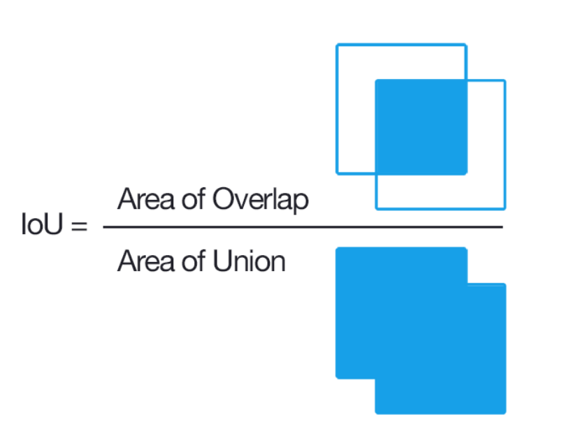
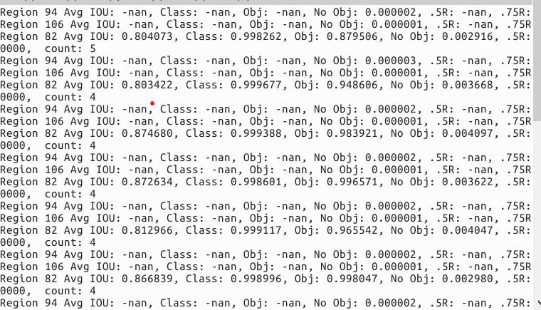
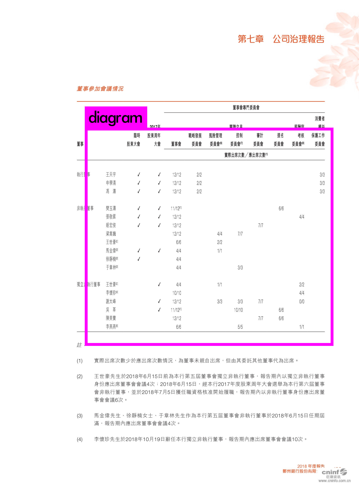
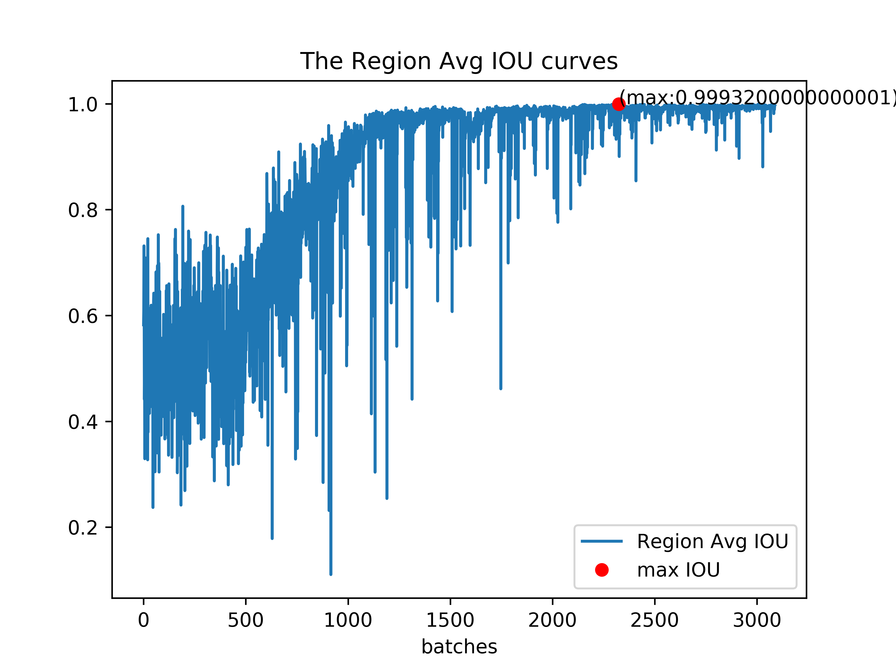
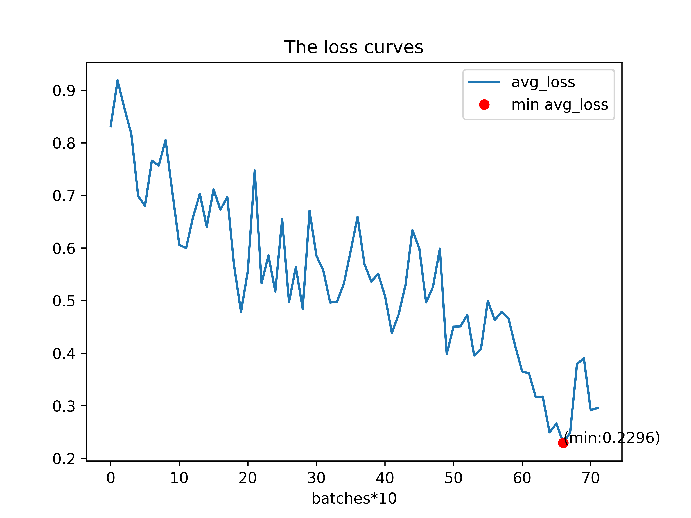

学校毕马威比赛时做的一个小项目，没有进决赛，有点遗憾...😢
# yolov3使用体验
---
[官网链接](https://pjreddie.com/darknet/yolo/)
第一次使用yolov3训练数据，操作虽然简单，但是步骤对于小白来说还是有点繁琐的👀
<!-- more -->
## 安装参考  

```shell
git clone https://github.com/pjreddie/darknet
cd darknet
make
```
---
注意自己的cuda配置就好，这里我用的是cuda10.0，貌似没有什么幺蛾子  
**另外要注意**如果要使用GPU，需要修改Makefile，修改如下:  
```shell
GPU=1    #如果使用GPU设置为1，CPU设置为0
CUDNN=1  #如果使用CUDNN设置为1，否则为0
OPENCV=1 #如果调用摄像头，还需要设置OPENCV为1，否则为0
OPENMP=0 #如果使用OPENMP设置为1，否则为0
DEBUG=0  #如果使用DEBUG设置为1，否则为0

# 如果已经建立了软连接的话，GPU路径一般不用改，因为cuda一般装在/usr/local/cuda下，如果是别的版本，可以使用ln命令建立软连接
```
😒make如果出现问题，输入make clean后再进行排错  
### 测试是否安装成功
```shell
./darknet detect cfg/yolov3.cfg yolov3.weights data/dog.jpg
```
成功的话，可以再darknet/preditions看到一张预测效果图
  

**获取与训练模型权重**  
```shell
wget https://pjreddie.com/media/files/yolov3.weights
```


## 制作数据集
训练自己的模型可以使用已有的yolov3的预训练模型进行迁移学习  
### 打标签
使用labelImg或者Yolomark制作标签数据(xml类型),得到xml文件后还不能直接用于模型训练，这里需要进行一下转换  
[参考连接：用YOLO实现目标检测](https://karbo.online/dl/yolo_starter/)  
>训练YOLO需要使用特别格式的标签数据文件，它是一个.txt文本文件。
这个.txt文件的每一行是一个标签，一个文件对应一张图片，它看起来像这样：
<object-class> <x> <y> <width> <height>   
注意此处的中心x、中心y、框width和框height是相对于图片宽度和高度的值，都是不大于1的小数
----

参考链接的voc_label.py，我修改了一下，来适应我的项目      
voc_label.py
```python
import xml.etree.ElementTree as ET
import pickle
import os
from os import listdir, getcwd
from os.path import join
from tqdm import tqdm
# sets=[('2012', 'train'), ('2012', 'val'), ('2007', 'train'), ('2007', 'val'), ('2007', 'test')]
sets = [('2019', 'train'), ('2019', 'val'), ('2019', 'test')]
# classes = ["aeroplane", "bicycle", "bird", "boat", "bottle", "bus", "car", "cat", "chair", "cow", "diningtable", "dog", "horse", "motorbike", "person", "pottedplant", "sheep", "sofa", "train", "tvmonitor"]
classes = [
    "diagram"
]

def convert(size, box):
    dw = 1./size[0]
    dh = 1./size[1]
    x = (box[0] + box[1])/2.0
    y = (box[2] + box[3])/2.0
    w = box[1] - box[0]
    h = box[3] - box[2]
    x = x*dw
    w = w*dw
    y = y*dh
    h = h*dh
    return (x,y,w,h)

def convert_annotation(year, image_id):
    in_file = open('VOCdevkit/VOC%s/Annotations/%s.xml'%(year, image_id))
    out_file = open('VOCdevkit/VOC%s/labels/%s.txt'%(year, image_id), 'w')
    tree=ET.parse(in_file)
    root = tree.getroot()
    size = root.find('size')
    w = int(size.find('width').text)
    h = int(size.find('height').text)

    for obj in root.iter('object'):
        difficult = obj.find('difficult').text
        cls = obj.find('name').text
        if cls not in classes or int(difficult) == 1:
            continue
        cls_id = classes.index(cls)
        xmlbox = obj.find('bndbox')
        b = (float(xmlbox.find('xmin').text), float(xmlbox.find('xmax').text), float(xmlbox.find('ymin').text), float(xmlbox.find('ymax').text))
        bb = convert((w,h), b)
        out_file.write(str(cls_id) + " " + " ".join([str(a) for a in bb]) + '\n')

wd = getcwd()

for year, image_set in tqdm(sets):
    if not os.path.exists('VOCdevkit/VOC%s/labels/'%(year)):
        os.makedirs('VOCdevkit/VOC%s/labels/'%(year))
    image_ids = open('VOCdevkit/VOC%s/ImageSets/Main/%s.txt'%(year, image_set)).read().strip().split()
    list_file = open('%s_%s.txt'%(year, image_set), 'w')
    for image_id in image_ids:
        list_file.write('%s/VOCdevkit/VOC%s/JPEGImages/%s.jpg\n'%(wd, year, image_id))
        convert_annotation(year, image_id)
    list_file.close()

os.system(f"cat {sets[0][0]}_train.txt {sets[0][0]}_val.txt > train.txt")
os.system(f"cat {sets[0][0]}_train.txt {sets[0][0]}_val.txt {sets[0][0]}_test.txt > train.all.txt")

```
对于数据的train_test_split，我也写了一个脚本，用于自动分开train,val,test三种xml  
prepocess.py    
```python
"""
将raw_data 和 raw_label 分成dataset/train data/test 两个个文件夹
"""

from sklearn.model_selection import train_test_split
import os
import shutil
from tqdm import tqdm
test_size = 0.2
val_size = 0.1
# raw_data_pth = "./raw_data"
raw_label_pth = "./raw_label"
raw_data_pth = "./raw_data"
dataset = "./VOCdevkit/VOC2019"

if __name__ == "__main__":

    raw_label_list=[]
    for root, dirs, files in os.walk(raw_label_pth):
        for file in files:
            # if "(" not in files and ")" not in files:
            # file.replace(' ','-')
            if "DS" in files:
                continue
            shutil.copy(f"{raw_label_pth}/{file}",f"{dataset}/Annotations/{file}")
            shutil.move(f"{raw_data_pth}/{file[:-4]}.jpg",f"{dataset}/JEPGImages/{file[:-4]}.jpg")
            raw_label_list.append(file)
    
    
    # raw_data_list = [x[:-4]+".jpg" for x in raw_label_list]

    train_val_label, test_label = train_test_split(
                                                raw_label_list,
                                                test_size=test_size,
    )
    train_label, val_label = train_test_split(
                                                train_val_label,
                                                test_size=val_size,
    )

    print("move train label")
    with open(f"{dataset}/ImageSets/Main/train.txt","w") as f:
        for label in tqdm(train_label):
            # shutil.copy(f"{raw_label_pth}/{label}",f"{dataset}/train/{label}")
            f.write(f"{label[:-4]}\n")
    print("move test label")
    with open(f"{dataset}/ImageSets/Main/test.txt","w") as f:
        for label in tqdm(test_label):
            # shutil.copy(f"{raw_label_pth}/{label}",f"{dataset}/test/{label}")
            f.write(f"{label[:-4]}\n")

    print("move val label")
    with open(f"{dataset}/ImageSets/Main/val.txt","w") as f:
        for label in tqdm(val_label):
            shutil.copy(f"{raw_label_pth}/{label}",f"testImg/{label}")
            f.write(f"{label[:-4]}\n")


```
数据文件夹如下所示: 
```
.
└── VOC2019
    ├── Annotations # 所有的xml的存放位置
    ├── ImageSets # 图片的信息
    ├── JPEGImages # 所有的训练图片存放位置
    └── labels # yolo-voc模型提取坐标信息的位置
```

### 根据需求修改配置文件  
[官方参考](https://github.com/AlexeyAB/darknet#how-to-train-with-multi-gpu)
darknet/cfg下有很多模型的训练配置文件，根据自己下载的预训练模型进行复制，复制出来后修改就行，这里我用的是yolov3.cfg，再数据文件夹同目录下再新建一个文件夹**model**  
```
 model
├── diagram.data # 存放训练测试相关路径
├── diagram.names # 分类的名字
├── yolov3.cfg # 模型配置文件
└── yolov3.weights # 模型权重
```
>classes是种类的个数、train是训练图片路径的文本文件，valid是验证图片路径的文本文件，names是种类名字的文件，backup路径则用于保存备份的权重文件（每迭代100次保存一次文件（带_last后缀），每1000次保存一次文件（带_xxxx后缀））。如果没有验证集，则设置valid为与train相同的值即可，那么将测试在训练集上的精度。  

模型参数的意思可以参考[这里](https://blog.csdn.net/weixin_42731241/article/details/81474920)  
我的项目里面需要我们计算IOU(Intersection over Union，也被称为交并集之比)，用以计算我们网络的效果  
  
yolo的训练数据中正好会输出这个结果  

## 训练
- 下载预训练权重
前面的我们的文件存放的配置都是按照VOC数据集的存放位置来做的，这里我们也使用VOC的预训练权重  
```shell
./darknet detector train cfg/voc.data cfg/yolov3-voc.cfg darknet53.conv.74
# 下载比较慢
```
训练使用以下的命令  
```shell
darknet/darknet detector train model/diagram.data model/yolov3-voc.cfg model/darknet53.conv.74
```
这句命令要根据当前的路径来使用  
  
这里的IOU等出现nan是正常的，建议batch选择1，训练一轮后确认是否能存模型再继续操作  

#### 训练脚本
训练的时候可能需要指定gpu，这里提供一个脚本  
**train.sh**  
```shell
# 功能说明：
# -gpu 指定gpu
# -c 指定重新训练还是第一次训练
# -n 指定继续训练的第几轮权重文件，查看backup_1文件
CUDA_VISIBLE_DEVICES=0
export CUDA_VISIBLE_DEVICES
diagram_data="diagram.data"
# log_dir="logdir"
num=900
while getopts ":c:g:n:" opt
do
    case $opt in
        n)
            num=$OPTARG
        ;;
        c)
            case $OPTARG in
            f)
                darknet/darknet detector train model/diagram_1.data model/yolov3-voc.cfg model/darknet53.conv.74 |tee logdir/log/first_train_yolov3.log
            ;;
            r)
                darknet/darknet detector train model/$diagram_data model/yolov3-voc.cfg backup/yolov3-voc_900.weights |tee logdir/log/train_yolov3.log
            ;;
            esac
        ;;
        g)
            CUDA_VISIBLE_DEVICES=$OPTARG
            export CUDA_VISIBLE_DEVICES
        ;;
        ?)
        echo "未知参数"
        exit 1;;
    esac
done
```

## 测试
这里我主要参考IOU和recall，暂时还没有map的修改  
**测试一张图片的方法**  
**批量获取预测坐标的方法**   
**批量计算IOU,recall的方法**  

这里实现了一个脚本做这三件事  

### 测试脚本
```shell
./test.sh -c [test][valid][recall]
```
[YOLOv3使用笔记——计算mAP、recall](https://blog.csdn.net/cgt19910923/article/details/80524173)    
- test: 输入一张图片路径，输出predition
- vaild: 将.data 里面的vaild数据进行验证，输出到result
- recall: 这个需要修改detector.c


**test.sh**  
```shell
CUDA_VISIBLE_DEVICES=1
diagram_data="diagram.data"
backup="backup"
num="final"
export CUDA_VISIBLE_DEVICES

cd darknet
while getopts ":d:c:g:n:" opt
do
    case $opt in
        d)
             backup=$OPTARG
        ;;
        n)
            num=$OPTARG
        ;;
        c)
            case $OPTARG in
            test)
                ./darknet detector test ../model/$diagram_data ../model/yolov3-voc-test.cfg ../$backup/yolov3-voc_$num.weights
            ;;
            vaild)
                ./darknet detector valid ../model/$diagram_data ../model/yolov3-voc.cfg ../$backup/yolov3-voc_$num.weights
            ;;
            recall)
                ./darknet detector recall ../model/$diagram_data ../model/yolov3-voc-test.cfg ../$backup/yolov3-voc_$num.weights
            ;;
            ?)
                echo "未知参数"
                exit 1;;
            esac

        ;;
        g)
            CUDA_VISIBLE_DEVICES=$OPTARG
        ;;
        ?)
        echo "未知参数"
        exit 1;;
    esac
done
```

## 效果与项目相关  
项目是识别一个数据表格(无边框或者边框残缺)  
以下是我的项目总目录(只显示文件夹),供参考
```shell
.
├── backup
├── backup_1
├── darknet
│   ├── backup
│   ├── cfg
│   ├── data
│   │   └── labels
│   ├── examples
│   ├── include
│   ├── obj
│   ├── __pycache__
│   ├── python
│   ├── results
│   ├── scripts
│   └── src
├── final_model
├── logdir
│   ├── csv
│   ├── log
│   └── png
├── main
├── model
├── raw_data
├── raw_label
├── testImg
└── VOCdevkit
    └── VOC2019
        ├── Annotations
        ├── ImageSets
        │   └── Main
        ├── JPEGImages
        └── labels
```



**训练信息**  
这个需要自己写脚本将训练时终端的输出存到一个文件，这步操作再train.sh里面完成，文本解析这里提供一个脚本
### 训练信息脚本
parseLog.py
```python
# -*- coding: utf-8 -*-
"""
Created on 2019-11-27 08:30:25
@author: lxc
"""
#this code is to extract the yolov3 train log

import inspect
import os
import random
import sys
import pandas as pd
import numpy as np
import matplotlib.pyplot as plt

from argparse import ArgumentParser

parser = ArgumentParser(description='''
                        put the yolo log path to parse
                        this python script will output [log_path]_loss.txt and [log_path]_iou.txt
                        and plot a loss curve , a iou curve of the log file
                        ''')
parser.add_argument('--log_root',type=str,default="logdir",
                    help="log diratory path")
parser.add_argument('--log',type=str,default="first_train_yolov3.log",
                    help="log file name")
args = parser.parse_args()
log_pth = args.log_root+'/log/'+args.log
loss_pth = args.log_root+'/csv/'+args.log.split('.')[0]+'_loss.csv'
iou_pth = args.log_root+'/csv/'+args.log.split('.')[0]+'_iou.csv'
png_root =args.log_root+'/png/' 
def extract_log(log_file,new_log_file,key_word):
    f=open(log_file,'r')
    train_log=open(new_log_file,'w')
    for line in f:
        if 'Syncing' in line:        #多gpu同步信息，我就一个GPU,这里是可以不要的。
            continue
        if 'nan' in line:             #包含nan的不要
            continue
        if key_word in line:        #包含关键字
            train_log.write(line)
    f.close()
    train_log.close()


def plot_loss():
    lines =16000       #rows to be draw
    result = pd.read_csv(loss_pth, skiprows=[x for x in range(lines) if ((x%10!=9) |(x<1000))] ,error_bad_lines=False, names=['loss', 'avg', 'rate', 'seconds', 'images'])
    result.head()

    #print(result)

    result['loss']=result['loss'].str.split(' ').str.get(1)
    result['avg']=result['avg'].str.split(' ').str.get(1)
    result['rate']=result['rate'].str.split(' ').str.get(1)
    result['seconds']=result['seconds'].str.split(' ').str.get(1)
    result['images']=result['images'].str.split(' ').str.get(1)
    result.head()
    result.tail()

    '''
    print(result['loss'])
    print(result['avg'])
    print(result['rate'])
    print(result['seconds'])
    print(result['images'])
    '''
    result['loss']=pd.to_numeric(result['loss'])
    result['avg']=pd.to_numeric(result['avg'])
    result['rate']=pd.to_numeric(result['rate'])
    result['seconds']=pd.to_numeric(result['seconds'])
    result['images']=pd.to_numeric(result['images'])
    result.dtypes

    fig = plt.figure()
    ax = fig.add_subplot(1, 1, 1)
    ax.plot(result['avg'].values,label='avg_loss')

    min_x = np.argmin(result['avg'])
    ax.plot(min_x,result['avg'][min_x],'ro',label='min avg_loss')
    show_min='(min:{:.4f})'.format(result['avg'][min_x])
    ax.annotate(show_min,xytext=(min_x,result['avg'][min_x]),xy=(min_x,result['avg'][min_x]))
    
    #ax.plot(result['loss'].values,label='loss')
    ax.legend(loc='best')
    ax.set_title('The loss curves')
    ax.set_xlabel('batches*10')
    fig.savefig(png_root+'avg-loss.png',dpi=600)
def plot_iou():
    lines = 16000    #根据train_log_iou.txt的行数修改
    result = pd.read_csv(iou_pth, skiprows=[x for x in range(lines) if (x%10==0 or x%10==9) ] ,error_bad_lines=False, names=['Region Avg IOU', 'Class', 'Obj', 'No Obj', 'Avg Recall','count'])
    result.head()
    
    result['Region Avg IOU']=result['Region Avg IOU'].str.split(': ').str.get(1)
    result['Class']=result['Class'].str.split(': ').str.get(1)
    result['Obj']=result['Obj'].str.split(': ').str.get(1)
    result['No Obj']=result['No Obj'].str.split(': ').str.get(1)
    result['Avg Recall']=result['Avg Recall'].str.split(': ').str.get(1)
    result['count']=result['count'].str.split(': ').str.get(1)
    result.head()
    result.tail()
    
    # print(result.head())
    # print(result.tail())
    # print(result.dtypes)
    print(result['Region Avg IOU'])
    
    result['Region Avg IOU']=pd.to_numeric(result['Region Avg IOU'])
    result['Class']=pd.to_numeric(result['Class'])
    result['Obj']=pd.to_numeric(result['Obj'])
    result['No Obj']=pd.to_numeric(result['No Obj'])
    result['Avg Recall']=pd.to_numeric(result['Avg Recall'])
    result['count']=pd.to_numeric(result['count'])
    result.dtypes
    
    fig = plt.figure()
    ax = fig.add_subplot(1, 1, 1)
    ax.plot(result['Region Avg IOU'].values,label='Region Avg IOU')
    
    max_x = np.argmax(result['Region Avg IOU'].values)
    ax.plot(max_x,result['Region Avg IOU'][max_x],'ro',label='max IOU')
    show_max='(max:{})'.format(result['Region Avg IOU'][max_x])
    ax.annotate(show_max,xytext=(max_x,result['Region Avg IOU'][max_x]),xy=(max_x,result['Region Avg IOU'][max_x]))
    
    # ax.plot(result['Class'].values,label='Class')
    # ax.plot(result['Obj'].values,label='Obj')
    # ax.plot(result['No Obj'].values,label='No Obj')
    # ax.plot(result['Avg Recall'].values,label='Avg Recall')
    # ax.plot(result['count'].values,label='count')
    ax.legend(loc='best')
    ax.set_title('The Region Avg IOU curves')
    ax.set_xlabel('batches')
    fig.savefig(png_root+'region-avg-iou.png',dpi=600)

if __name__ == "__main__":
    extract_log(log_pth,loss_pth,'images')
    extract_log(log_pth,iou_pth,'IOU')
    plot_loss()
    plot_iou()

```
  
  
